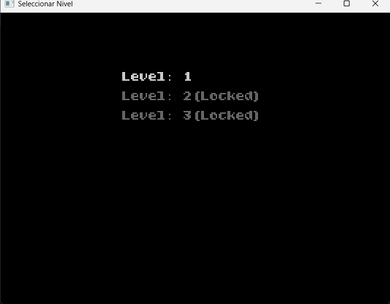
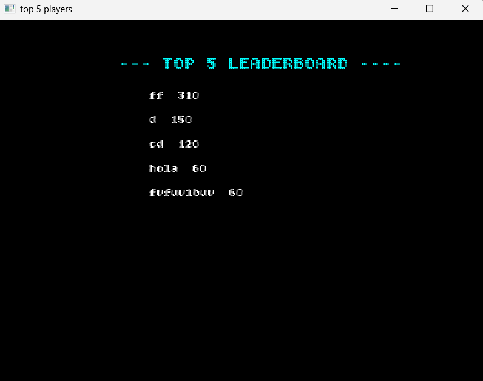
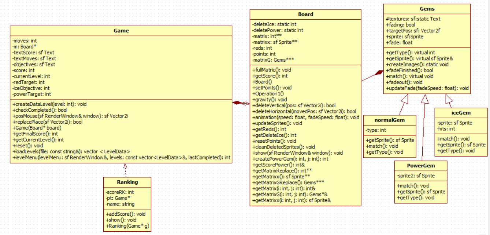

# proyectoProgra1-match-3

Estudiante: Josué David Madrigal Arias

Profesor: Alejandro Flores

Curso: Programación 1

Sede: UNA

Descripción del Proyecto
-
Este proyecto implementa un juego Match-3 estilo Candy Crush, desarrollado en C++ utilizando la biblioteca SFML 2.6.
El jugador debe combinar gemas del mismo tipo mediante clics consecutivos para formar líneas de tres o más, obteniendo puntos y cumpliendo objetivos específicos por nivel.

El juego cuenta con diferentes tipos de gemas (normales, de hielo y de poder), efectos visuales, animaciones, niveles con objetivos y un sistema de puntuaciones, es un proyecto muy simple, que cumple las funciones necesarias para ser "jugable".

Objetivos del Proyecto
-
-Aplicar los conceptos de programación orientada a objetos(POO).

-Utilizar herencia,polimorfismo y composición.

-Crear un sistema de niveles, objetivos y puntuaciones.

-Implementar animaciones y manejo de eventos con Sfml.

-Practicar el uso de ramas y control de versiones con Git y GitHub.

Estructura del Proyecto:
-
ProyectoProgra1-Match3/
│
├── README.md

├── CHANGELOG.md

├── documentacion proyecto match-3.pdf

├── .git/

│

├── Capturas de pantalla/

│   ├── pantallaFinal.png

│   ├── clasificaciones.png

│   ├── selector.png

│   ├── UML.png

│   └── tablero.png

│

├── ProyectoProgra1-Match3/

│   ├── ProyectoProgra1-Match3.sln

│   ├── x64/

│   │   └── Debug/

│   │       ├── ProyectoProgra1-Match3.exe

│   │       ├── assets/

│   │       │   ├── gem1.png

│   │       │   ├── gem2.png

│   │       │   ├── gem3.png

│   │       │   ├── gem4.png

│   │       │   ├── gem5.png

│   │       │   ├── iceGem.png

│   │       │   ├── powerGem.png

│   │       │   ├── breakIce.png

│   │       │   ├── levels.txt

│   │       │   ├── LeaderBoard.txt

│   │       │   └── BitcountGridDouble_Cursive-Regular.ttf

│   │       ├── sfml-graphics-d-2.dll

│   │       ├── sfml-system-d-2.dll

│   │       ├── sfml-window-d-2.dll

│   │       └── ...

│   │

│   ├── ProyectoProgra1-Match3/

│   │   ├── src/

│   │   │   ├── main.cpp

│   │   │   ├── Game.cpp / Game.h

│   │   │   ├── Board.cpp / Board.h

│   │   │   ├── Gems.cpp / Gems.h

│   │   │   ├── Ranking.cpp / Ranking.h

│   │   │   └── ...

│   │   |

│   │   │── sfml-graphics-d-2.dll

│   │   │── sfml-system-d-2.dll

│   │   │── sfml-window-d-2.dll

│   │   │── ...

│   │   └── assets/ (igual que arriba)

│   │

│└── ...

│

└── ...

 🖼️ Imágenes del Juego:
 -
### Ventana de selección de niveles  

### Juego en progreso  

### Ventana de resultados  

### Ventana de selección de niveles  

Instrucciones de Instalación:
-
1. Instalar **SFML 2.6** en tu entorno.
2. Compilar el proyecto en **Visual Studio**.
3. Ejecutar el archivo `.exe` generado.
4. Seleccionar un nivel y jugar 🎮.

Flujo de Clases:
-
### UML

